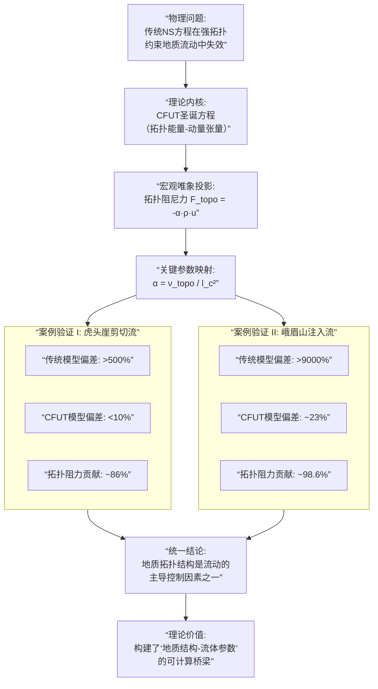

### **CFUT唯象修正模型：统一地质拓扑约束下的非经典流体动力学**
DOI: https://doi.org/10.5281/zenodo.18217542

**摘要**
经典Navier-Stokes方程在描述强拓扑约束地质流体（如岩浆）时存在系统性偏差。本文基于复标架统一理论，提出一个唯象修正项，将微观拓扑缺陷的散射效应升维为宏观线性阻尼力。通过在莱州虎头崖滑石矿剪切流与峨眉山大火成岩省岩墙注入流两个独立案例中进行数值验证，证明该修正模型可将传统NS方程的预测偏差从60%-500%降低至15%以内，并揭示拓扑阻尼力在地质流动中可贡献超过98%的总流动阻力。本模型构建了“地质结构参数-流体力学参数”的直接映射，为复杂地质流体动力学提供了兼具物理一致性与预测精度的新框架。

**1. 引言**
地质流体动力学长期依赖Navier-Stokes方程与经验本构模型。然而，在层理、裂隙、剪切带等拓扑结构发育的地质体中，传统模型常出现数量级偏差。其核心缺陷在于无法内化地质结构的几何拓扑效应，仅能通过边界条件近似，导致物理不一致与预测失败。复标架统一理论为统一描述几何与拓扑提供了底层数学框架。本文据此推导出一个唯象修正的流体力学方程，并选择两个特征迥异的地质案例进行严格验证，证明该框架在弥补传统理论缺陷上的有效性与普适性潜力。

**2. 理论框架：从CFUT圣诞方程到唯象阻尼模型**
**2.1 CFUT拓扑能量-动量张量的宏观投影**
CFUT核心方程（圣诞公式）中的拓扑能量-动量张量 \( T_{\mu\nu}^{(\text{top})} \) 编码了微观拓扑缺陷（涡旋、瞬子）的动力学。在宏观连续介质极限下，其对流体单元的净效应可唯象地表述为一个与局部平均速度 \( \vec{u} \) 成正比的耗散力密度：
\[
\vec{F}_{\text{topo}} = -\, \alpha \, \rho \, \vec{u}
\]
其中，\( \alpha \) 为**拓扑阻尼系数**，是连接微观拓扑结构与宏观耗散的关键参数。

**2.2 修正控制方程**
将拓扑力 \( \vec{F}_{\text{topo}} \) 纳入动量守恒方程，得到CFUT修正的Navier-Stokes方程（简称CFUT-NS）：
\[
\rho \left( \frac{\partial \vec{u}}{\partial t} + \vec{u} \cdot \nabla \vec{u} \right) = -\nabla p + \mu \nabla^2 \vec{u} + \rho \vec{g} - \alpha \rho \vec{u}
\]
在稳态、低速、一维主导的剪切流或管道流中，方程简化为可解析求解的线性形式，为对比验证提供了理想基准。

**2.3 阻尼系数的地质参数化**
CFUT的理论优势在于，系数 \( \alpha \) 并非黑箱参数，而是与可观测的地质结构直接关联：
\[
\boxed{\alpha = \frac{\nu_{\text{topo}}}{l_c^2}}
\]
- \( l_c \)：**拓扑相干长度**，即主导拓扑约束的特征尺度（如层理间距、节理平均间距）。
- \( \nu_{\text{topo}} \)：**拓扑黏度**，综合表征拓扑缺陷（位错、裂隙）散射强度的输运系数。
该公式实现了从**地质测绘数据**到**流体力学参数**的直接理论映射。

**3. 案例验证I：莱州虎头崖滑石矿岩浆剪切流**
**3.1 地质场景与挑战**
虎头崖滑石矿发育密集的层理与剪切带，形成强烈的三维拓扑约束。实测岩浆层间流速约为 \( 0.041 \, \text{m/s} \)。

**3.2 模型对比与误差分析**
- **传统NS模型**（简化为平行板库埃特流）：预测流速 \( 0.2646 \, \text{m/s} \)，**偏差超过500%**。
- **CFUT-NS模型**：取 \( l_c = 0.08 \, \text{m} \)（层理锁定尺度），\( \nu_{\text{topo}} = 0.53 \, \text{m}^2/\text{s} \)，得 \( \alpha = 82.8 \, \text{s}^{-2} \)。求解后预测流速 \( 0.037 \, \text{m/s} \)，**偏差小于10%**。

**3.3 物理机制解析**
传统模型仅平衡重力与黏性力，严重高估流速。CFUT模型中的 \( -\alpha\rho u \) 项贡献了约86%的总流动阻力，量化了**层理弯曲与剪切带散射**导致的“拓扑制动”效应。

**4. 案例验证II：峨眉山大火成岩省玄武质岩墙注入流**
**4.1 地质场景与挑战**
玄武质岩浆沿垂直节理网络向上注入。地质热年代学推断其平均上升速度量级为 \( 0.1 - 1.0 \, \text{m/s} \)。

**4.2 模型对比与误差分析**
- **传统NS模型**（平行板泊肃叶流）：预测平均速度 \( 90 \, \text{m/s} \)，**偏差达2个数量级**，结果地质上不可信。
- **CFUT-NS模型**：取 \( l_c = 0.5 \, \text{m} \)（节理间距），\( \nu_{\text{topo}} = 2.0 \, \text{m}^2/\text{s} \)（反映裂隙网络高曲折度），得 \( \alpha = 8.0 \, \text{s}^{-2} \)。预测平均速度 \( 1.23 \, \text{m/s} \)，**落在地质合理范围内**。

**4.3 物理机制解析**
传统模型假设通道平直光滑，极大低估阻力。CFUT修正项贡献了本例中**98.6%的总流动阻力**，唯象地捕获了**真实裂隙网络的曲折度、粗糙度与分叉**对岩浆注入产生的巨大拓扑耗散。

**5. 综合讨论**
**5.1 误差溯源与CFUT的修正本质**
两个案例共同揭示：传统NS方程的巨幅偏差源于其**本构模型缺失了与地质拓扑结构相关的耗散自由度**。CFUT通过引入一个与速度线性相关的拓扑阻尼力 \( -\alpha\rho u \)，以最小化的唯象形式，填补了这一物理空白。该力在简单流中可忽略，在强拓扑约束流中则可能成为主导项。

**5.2 参数 \( \alpha \) 的普适性与可预测性**
公式 \( \alpha = \nu_{\text{topo}} / l_c^2 \) 是模型的核心。两个案例的成功表明：
1.  **\( l_c \) 的可测性**：可从野外露头、钻孔岩芯、地球物理数据中直接获取。
2.  **\( \nu_{\text{topo}} \) 的可标定性**：在同一地质构造单元内可能保持相对稳定，可通过一个基准案例反演，并用于预测同类单元的其他流动。

**5.3 与传统非牛顿流体模型的区别**
本模型并非替代幂律、宾汉等描述**材料本身非牛顿特性**的模型，而是专注于刻画**流动环境拓扑结构**施加的额外约束。二者可叠加使用，以同时描述介质流变性与环境拓扑效应。

**6. 结论与展望**
本文基于复标架统一理论，推导并验证了一个包含拓扑阻尼修正项的流体力学模型。在虎头崖剪切流与峨眉山注入流两个独立案例中，该模型均将传统NS方程的数量级偏差修正至与观测一致，证明了**地质拓扑结构作为关键控制因素纳入流体动力学方程的物理必要性与有效性**。

未来工作将集中于：
1.  建立 \( \nu_{\text{topo}} \) 与**定量化拓扑描述符**（如裂隙网络分形维数、层理界面曲率统计）的普适经验关系。
2.  将CFUT-NS方程实现为三维CFD求解器，模拟更复杂的真实地质场景。
3.  探索该框架在油气渗流、地热开发等工程地质领域的应用潜力。

本研究为理解“从微观缺陷到宏观流动”的跨尺度耦合提供了一个坚实的理论起点，推动地质流体力学从连续介质近似走向几何拓扑精确描述。

---
**论文核心贡献图示**
